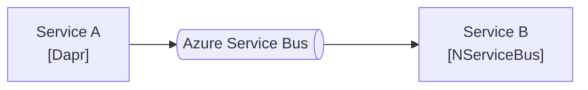

# nsb-dapr-poc
Proof of concept to validate bidirectional messaging between a service using NServiceBus and a service using Dapr.



# Prerequisites
1. .NET 8
1. Docker Desktop or Podman
1. Dapr CLI
1. Azure Service Bus Namespace Standard or Premium

# Running the Demo

## Azure Service Bus Configuration
Add a queue named `Samples.ASB.NativeIntegration` to the ASB namespace.   
By default, Dapr would use topic/subscriptions. For this demo we'll keep it simple by using a queue.

## Sender (Dapr)
Set the AzureServiceBus ConnectionString in `./components/servicebus-pubsub.yaml`.

Next, run the sender:

```ps1
cd ./Sender
dapr run --app-id sender --resources-path ../components -- dotnet run
```

- The metadata includes `NServiceBus.EnclosedMessageTypes` header for NServiceBus compatibility.

## Receiver (NServiceBus)
Run the receiver:
```ps1
cd ./Receiver
$Env:AzureServiceBus_ConnectionString="Endpoint=sb://..."
dotnet run 
```

See the Dapr message coming in.

- The NServiceBus configuration uses the custom `CloudEventSerializer` for Dapr compatibility.
- A convention is defined that types with the name `NativeMessage` and should be treated as messages, even if they don't implement NServiceBus interfaces.

# References
- [Particular Docs Azure Service Bus transport native integration sample](https://docs.particular.net/samples/azure-service-bus-netstandard/native-integration/)
- [Particular Docs NServiceBus Custom Serializers](https://docs.particular.net/nservicebus/serialization/custom-serializer)
- [GitHub - Particular/NServiceBus - SystemJson](https://github.com/Particular/NServiceBus/tree/master/src/NServiceBus.Core/Serializers/SystemJson)
- [Dapr Pub/Sub building block](https://docs.dapr.io/developing-applications/building-blocks/pubsub/)
